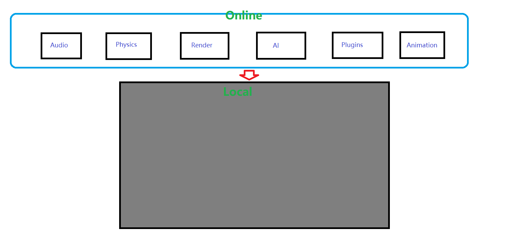

 

# Dark Game Engine

 English | [简体中文](./README-CN.md)

Dark is primarily an early-stage interactive application and rendering engine for Windows. Currently not much is implemented.

## Getting Started

Visual Studio 2017 or 2019 is recommended, Dark is officially untested on other development environments whilst we focus on a Windows build.

Start by cloning the repository with `git clone --recursive https://github.com/Acmen-Team/Dark`.

If the repository was cloned non-recursively previously, use `git submodule update --init` to clone the necessary submodules.

## The Plan
The plan for Dark is two-fold: to create a powerful 3D engine, explore a new generation of game engines.

### Main features to come:
- Fast 2D rendering (UI, particles, sprites, etc.)
- High-fidelity Physically-Based 3D rendering (this will be expanded later, 2D to come first)
- Support for Mac, Linux, Android and iOS
    - Native rendering API support (OpenGL, DirectX, Vulkan, Metal)
- Fully featured viewer and editor applications
- Fully scripted interaction and behavior
- Integrated 3rd party 2D and 3D physics engine
- Procedural terrain and world generation
- Artificial Intelligence
- Audio system

## Short term goals :

We want to make a game using the Dark game engine.By using the proper tools that would be required to make a game with Dark:

- Design the game scene by using Darknut, the Dark editor,
- Test the game inside Darknut, including the ability to save/load the created game,
- Load and play the game inside Sandbox.

We want everyone to be able to play the game on all desktop platforms (Windows, Mac and Linux). When this is implemented, attempt at the "Creating a game in one hour using Dark" will be made to see how far the engine has become.

## Proposed a new engine architecture :
 